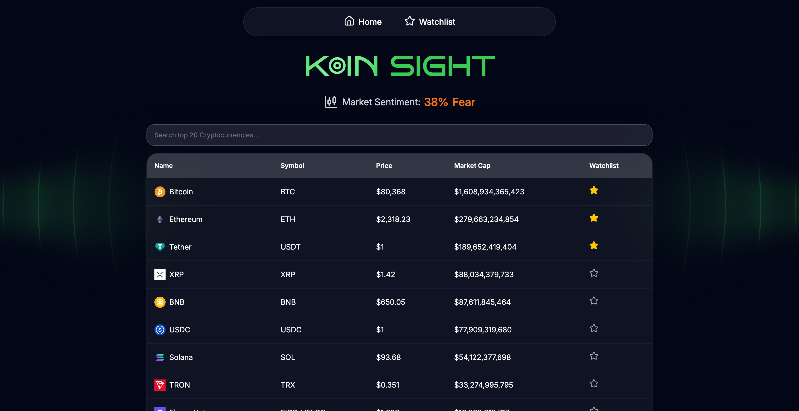
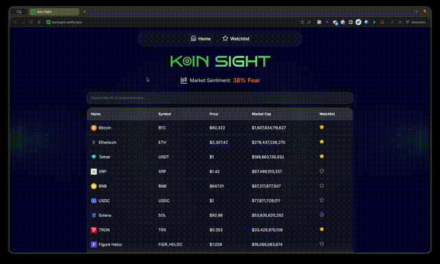
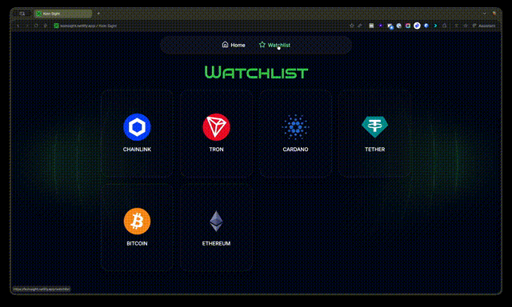

# Koin Sight



A sleek cryptocurrency tracking dashboard that provides real-time market insights, personalized watchlists, and fear & greed index analysis.

I made this app to help display dual currencies between USD and SGD as they are the primary currencies I use to track the market.

Built with React using a polished glassmorphism design for an intuitive user experience.

## Live Demo

https://koinsight.netlify.app

## Technology Stack

The project is built with:

- **React** for UI components and state management
- **Vite** for fast build tooling and hot module replacement
- **TailwindCSS** for responsive styling and glassmorphism theme
- **React Router** for page navigation and routing
- **React Query (TanStack)** for efficient API data fetching and caching
- **Recharts** for interactive data visualizations
- **GSAP & Three.js** for advanced animations and 3D effects
- **Lenis** for smooth scrolling experience

## API Integrations

- **CoinGecko API** - Real-time cryptocurrency market data and pricing
- **Airtable** - Backend storage for user watchlists and saved data
- **Fear & Greed Index API** - Market sentiment analysis and visualization

## Core Features

### Homepage


- Real-time market overview with top cryptocurrencies
- Fear & Greed Index display with visual meter and historical trends
- Smooth animations and interactive UI elements
- Responsive design for mobile and desktop

### Coin Details



- Comprehensive coin information including price in USD/SGD, market cap, price changes, and token details.
- Interactive price charts with Recharts
- One year historical data visualization

### Watchlist



- Create and manage personal cryptocurrency watchlist
- Save favorite coins to track
- Persistent storage via Airtable backend
- Quick access to key metrics for watched coins

## Project Structure

```
src/
├── components/          # Reusable React components
│   ├── CoinTable.jsx       # Market data table
│   ├── CoinDetail.jsx      # Detailed coin information
│   ├── FearGreedIndex.jsx  # Fear & Greed visualization
│   ├── Navbar.jsx          # Navigation header
│   └── reactBits/          # Animation & effect components
├── pages/              # Page-level components
│   ├── HomePage.jsx
│   ├── CoinDetailPage.jsx
│   └── WatchlistPage.jsx
├── services/           # API and utility functions
│   ├── coingecko.js       # CoinGecko API wrapper
│   ├── airtable.js        # Airtable API wrapper
│   └── greedFearIndex.js  # Fear & Greed Index service
└── App.jsx            # Main app component with routing
```

## Development Process

The project followed a structured, iterative development approach:

### 1. Initial Planning

- Researched project requirements and React patterns (state management, routing, props lifting)
- Identified required APIs (CoinGecko for market data, Airtable for persistence)
- Defined core components (price tables, charts, watchlist functionality)
- Researched and implemented wireframe concepts for page layouts

### 2. API & Airtable Testing

- Tested CoinGecko API integration with Bruno REST client to verify CORS behavior
- Configured Airtable base and validated connection for watchlist persistence
- Established secure environment variable setup for API credentials

### 3. Project Scaffolding

- Set up Vite for optimized build and fast development server
- Installed and configured TailwindCSS for utility-first styling
- Integrated TanStack React Query for efficient API data management
- Structured component hierarchy and routing with React Router

### 4. UI & Design Implementation

- Created glassmorphism theme using TailwindCSS
- Applied moodboard inspiration from Dribbble design references
- Implemented animated effects with GSAP and Three.js for visual polish
- Ensured mobile-responsive design across all screen sizes

### 5. Bug Fixes, Refactoring & Organization

- Refactored inline code into reusable, modular components
- Resolved CORS issues through proper API configuration and caching strategies with TanStack Query
- Organized component structure for maintainability
- Optimized performance and accessibility

## Environment Variables

To run this project locally, create a `.env.local` file with the following:

```
VITE_AIRTABLE_TOKEN= [your_airtable_api_token]
VITE_AIRTABLE_BASE_ID= [your_airtable_base_id]
VITE_AIRTABLE_TABLE_NAME= [your_table_name]

```

CoinGecko and Fear & Greed Index APIs do not require authentication because they are public APIs, so no additional keys are needed for those services.

CoinGecko API:

- Base URL: https://api.coingecko.com/api/v3
- Documentation: https://docs.coingecko.com/

Fear & Greed Index API:

- Base URL: https://api.alternative.me/fng/
- Documentation: https://alternative.me/crypto/fear-and-greed-index/

## Key Components

- **CoinTable** - Market data table with real-time updates and search filter functionality
- **FearGreedIndex** - Visual sentiment meter with color-coded status
- **CoinDetail** - In-depth coin analytics with interactive charts
- **Watchlist** - User-created persistent tracking lists via Airtable
- **Animation Effects** - BorderGlow, ShinyText, MagicRings for enhanced UX

## Future Enhancements

Planned features and improvements:

- Portfolio tracking and P&L calculations
- Currency conversion page between coins and fiat
- Expanded coin list with pagination and sorting options
